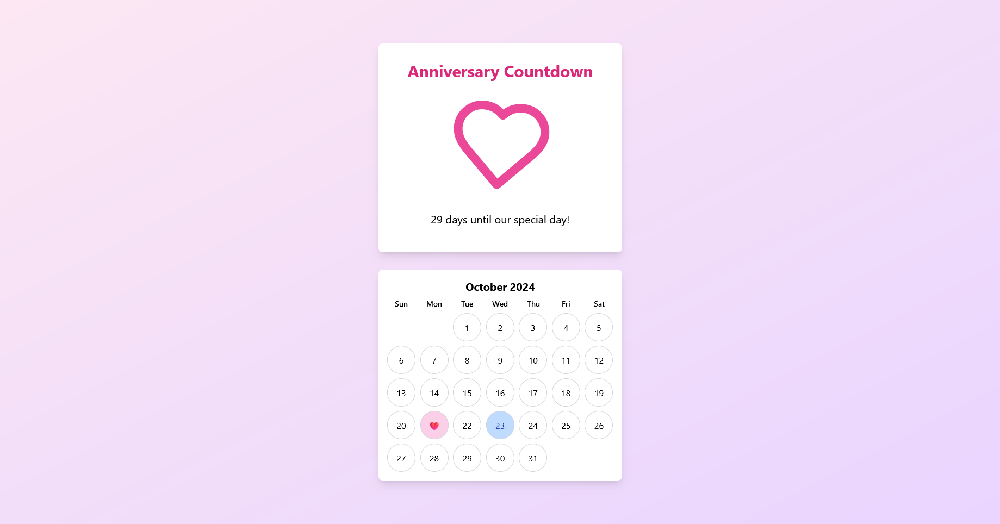

# 💖 Anniversary Countdown App

Welcome to the **Anniversary Countdown App**! 🎉 This app is a heartfelt project
designed to celebrate special moments with my girlfriends by counting the days
until our anniversary each month.



## 🚀 Features

- **Countdown Timer**: Displays the number of days until your anniversary.
- **Interactive Calendar**: Shows the current month with your anniversary date
  highlighted.
- **Beautiful UI**: A lovely design that enhances your romantic experience.
- **Real-time Updates**: Automatically updates every second to keep the
  countdown accurate.

## 📦 Installation

To set up the Anniversary Countdown App, follow these simple steps:

1. **Clone the repository**:

   ```bash
   git clone https://github.com/pyyupsk/anniversary.git
   cd anniversary
   ```

2. **Install the dependencies**:

   ```bash
   npm install
   ```

3. **Run the application**:

   ```bash
   npm dev
   ```

   Your app will be available at `http://localhost:5173/anniversary/`.

## 📜 License

This project is for personal use and does not have a specific license. Feel free
to use the code as you wish!
